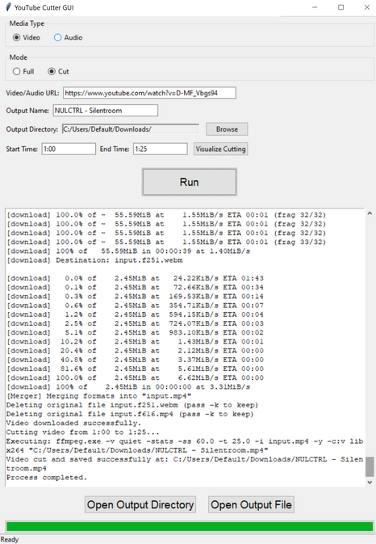

# yt-dlp Cutter GUI (yt-cutter-gui)

Automatically download and cut video or audio from all kinds of supported sites (YouTube, Twitter, SoundCloud, Facebook,...) using yt-dlp and ffmpeg - now with Tkinter GUI!



## Features

This project downloads and allows you to either save the entire video/audio or cut out a specific segment using a fully featured GUI:
- **yt-dlp** for downloading media.
- **ffmpeg** for processing media files.
- **tkinter** for the GUI.
- **url** for HTTP downloads.

- **One‑click dependency check**: yt‑dlp & ffmpeg are downloaded (with live progress) before the main window appears — no manual installs required.
- **Overall progress bar**: Download → Processing → Cleanup steps mapped to percentage (beta)
- **Real‑time status updates**: The white status box shows yt‑dlp’s download percentage/speed/ETA and ffmpeg’s conversion progress in real time.
- **Video & Audio modes**: Choose between full downloads or precise cuts — all in a single window.
- **Cross‑platform**: *maybe?* - not on the releases.

## Usage

1. Clone the repository or download code as zip.

3. Run the application:
    ```
    python main.py
    ```
4. Follow the on-screen instructions.

### License
- Using GPLv3 license. Learn more at the license tab.
